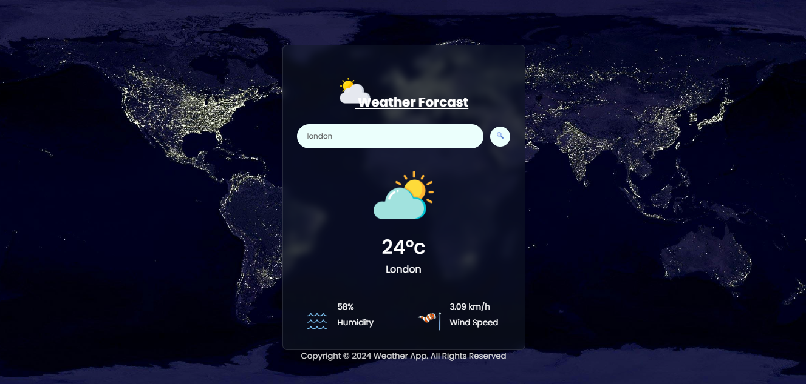

    

<h3 align="center">
Weather App with API Integration
</h3>
 

A simple weather project that can provide weather information in different countries with the help of API integration

 
 

## About the Project

    

 

## Getting Started

This project requires Xampp to be installed in your system. If you don't have it installed, you can follow these steps:

1.Clone the repository

    git clone https://github.com/dotyahya/euroweather-dashboard-app.git

2.Open [Index.html]()

 

## API Used
This is the API website that I used on this project
- [Open Weather](https://openweathermap.org/) and [Postman](https://www.postman.com/) for your reference.

## Built With

This project was built with the following technologies:

- [HTML]()
- [CSS]()
- [JavaScript]()
- [JSON]()
- [API Integration]()

## Contributing

Please read [CONTRIBUTING.md](CONTRIBUTING.md) for details on our code
of conduct, and the process for submitting pull requests to us.

## License

This project is licensed under the [CC0 1.0 Universal](LICENSE.md)
Creative Commons License - see the [LICENSE.md](LICENSE.md) file for
details

## Project Status

This project is part of the Coursera Project Network. It serves as a working example of how to integrate web technologies with an external API.

